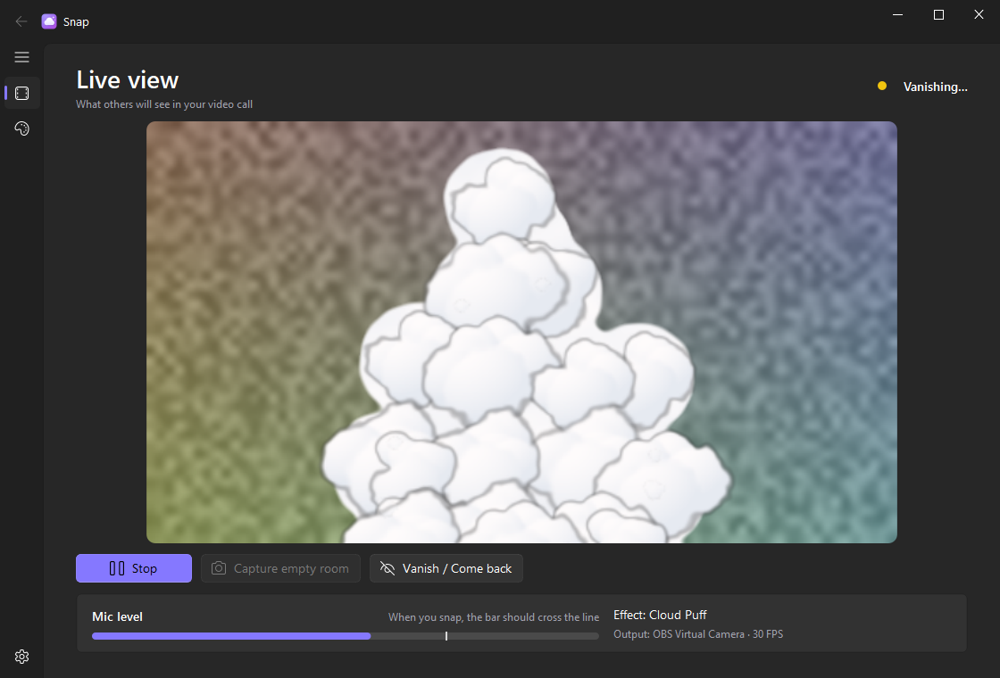
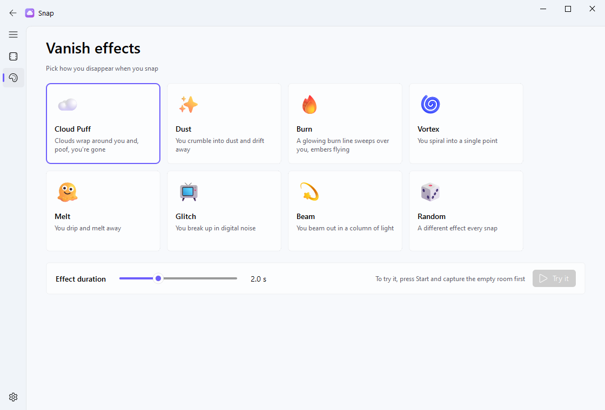

<div align="center">

**🇬🇧 English** · [🇹🇷 Türkçe](README.tr.md)


# Snap

**Snap your fingers, vanish from your video call.**
A virtual camera for Discord, Zoom, Teams, Meet… any app that lets you pick a camera.


<!-- TODO: add a demo GIF here ->  -->



</div>

---

Snap sits between your real webcam and your call app. It finds you in the picture with an
on-device AI model, and when you snap your fingers you disappear with an effect, leaving
only the empty room behind. Snap again and you come back.

> 🔒 Everything runs locally on your PC. Your camera and microphone never leave it.

## ✨ Features

- **7 vanish effects + Random**: pick one per snap, or let Snap surprise you.
- **AI person segmentation** (MediaPipe): no green screen, and it copes with lighting changes and clothes that match the wall.
- **Finger-snap detection**: reacts to the short, bright burst of a snap and ignores speech, music, hums and background noise.
- **Works in any call app**: outputs through the *OBS Virtual Camera* or *Unity Capture* driver.
- **Fluent design** (Windows 11 style) with light and dark themes, in English and Turkish.
- **Tray and hotkeys**: runs in the background, and you can vanish with `Ctrl + Shift + X` without touching the window.

## 🎭 Effects

| | Effect | What happens |
|---|---|---|
| ☁️ | **Cloud Puff** | Cartoon clouds roll in around you, and *poof*, you're gone as they drift away |
| ✨ | **Dust** | You crumble into dust and blow away in the wind |
| 🔥 | **Burn** | A glowing burn line climbs over you, throwing embers |
| 🌀 | **Vortex** | You spiral into a single point |
| 🫠 | **Melt** | You drip and melt away, column by column |
| 📺 | **Glitch** | You break up in digital noise and cut out |
| 💫 | **Beam** | Sci-fi teleport: a column of light, sparkles, gone |
| 🎲 | **Random** | A different effect every snap |

<div align="center">

</div>

## 📦 Install

### 1. A virtual camera driver (one time)

Snap needs a virtual camera device to send its picture to. Install **one** of these:

<details open>
<summary><b>Option A: OBS Studio</b> (easiest if you already have it)</summary>

Install [OBS Studio](https://obsproject.com/). That's all Snap needs: it drives OBS's
`OBS Virtual Camera` device itself, so OBS doesn't even have to be running.

</details>

<details>
<summary><b>Option B: Unity Capture</b> (tiny, no OBS)</summary>

1. [schellingb/UnityCapture](https://github.com/schellingb/UnityCapture) → **Code → Download ZIP**.
2. Extract it, open `Install`, **right-click `Install 1 Virtual Camera.bat` → Run as administrator**.
3. A camera called `Unity Video Capture` appears. The `Uninstall...bat` in the same folder removes it.

</details>

### 2. Snap

1. Download the latest `Snap-vX.Y.Z-win64.zip` from [**Releases**](../../releases).
2. Extract it anywhere and run `Snap\Snap.exe`.
3. Windows SmartScreen may warn about an unknown publisher (the exe isn't code-signed).
   Click **More info → Run anyway**.

## 🎬 Usage

1. Press **Start**.
2. Press **Capture empty room** and step out of the frame during the 3-second countdown.
3. Come back and **snap your fingers**. You vanish, and a second snap brings you back.
4. In Discord / Zoom / Teams / Meet, choose **`OBS Virtual Camera`** (or `Unity Video Capture`) as your camera.

Pick your effect on the **Effects** page; **Try it** plays it once so you can see it.
Your camera, microphone, sensitivity, theme and language are set on the **Settings** page.

### ⌨️ Hotkeys

| Hotkey | Action |
|---|---|
| `Ctrl` + `Shift` + `X` | Vanish / come back |
| `Ctrl` + `Shift` + `C` | Capture empty room |

They work even while Snap is minimised to the tray.

## 🛠️ Troubleshooting

| Problem | Fix |
|---|---|
| **"No virtual camera driver found"** | Install OBS Studio or Unity Capture (see [Install](#1-a-virtual-camera-driver-one-time)). |
| **"OBS's own virtual camera is running"** | Press *Stop Virtual Camera* in OBS; only one program can feed that device at a time. |
| **Camera won't open** | Another app is using the real webcam. In your call app, switch the camera to the virtual one. |
| **Snaps aren't detected** | Check the mic level bar crosses the line when you snap; raise **Sensitivity** or pick the right microphone. |
| **It triggers by itself** | Lower **Sensitivity**. |
| **A faint outline stays behind** | The room changed (light, a moved chair). Capture the empty room again. |
| **Not listed in Discord** | Restart Discord after installing the driver. |
| **Choppy picture** | Lower the resolution in Settings. In dark rooms webcams drop their frame rate, so more light helps. |

## 🧑‍💻 Run from source

Requires Windows and Python 3.11.

```bash
baslat.bat
```

`baslat.bat` creates a `.venv`, installs `requirements.txt` and launches the app. Or do it by hand:

```bash
python -m venv .venv
.venv\Scripts\python -m pip install -r requirements-dev.txt
.venv\Scripts\python -m snap
```

Run the tests with `.venv\Scripts\python -m pytest`, and build the zip with
`powershell -ExecutionPolicy Bypass -File scripts\build.ps1`. The build script runs the
packaged exe's `--selftest` before zipping.

```
snap/
├── core/        engine, camera, AI segmentation, snap detection, settings
│   └── vcam/    our own OBS / Unity Capture virtual camera writers
├── effects/     one file per effect
└── ui/          Fluent interface (PySide6 + QFluentWidgets)
```

## 📄 License

Snap is free software under the [GNU GPL v3.0](LICENSE).
Bundled third-party components and their licenses are listed in [THIRD_PARTY_NOTICES.md](THIRD_PARTY_NOTICES.md).
