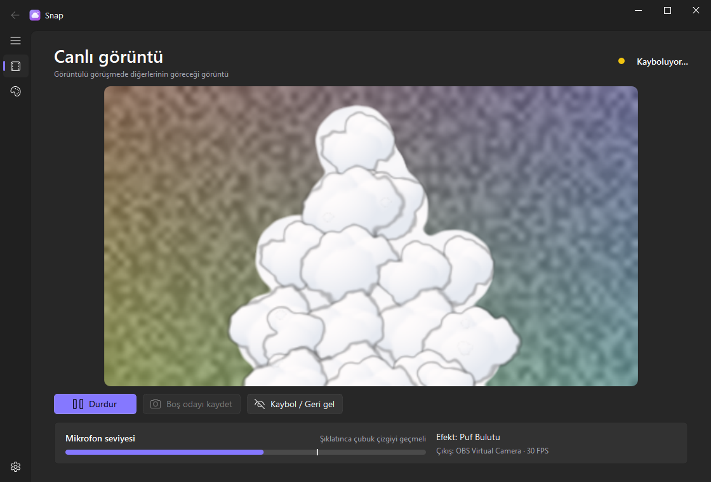
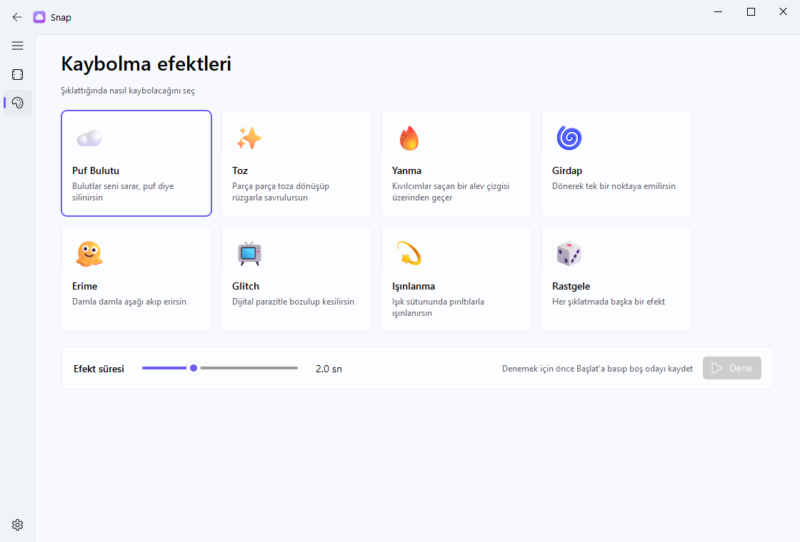

<div align="center">

[🇬🇧 English](README.md) · **🇹🇷 Türkçe**


# Snap

**Parmağını şıklat, görüntülü görüşmede ortadan kaybol.**
Discord, Zoom, Teams, Meet… kamera seçebilen her uygulamada çalışan sanal kamera.


<!-- TODO: demo GIF'i buraya ekle ->  -->



</div>

---

Snap, gerçek web kameran ile görüşme uygulaman arasına girer. Cihazda çalışan bir yapay
zeka modeliyle seni görüntüde bulur. Parmağını şıklattığında bir efektle kaybolursun,
geriye sadece boş oda kalır. Bir daha şıklatınca geri gelirsin.

> 🔒 Her şey bilgisayarında, yerel olarak çalışır. Kamera ve mikrofon görüntüsü hiçbir yere gitmez.

## ✨ Özellikler

- **7 kaybolma efekti + Rastgele**: her şıklatmada seçtiğin efekt, ya da her seferinde sürpriz.
- **Yapay zeka ile kişi ayırma** (MediaPipe): yeşil perde gerekmez. Işık değişse de, kıyafetin duvarla aynı renkte olsa da çalışır.
- **Parmak şıklatma algılama**: şıklatmanın kısa ve keskin sesini yakalar. Konuşma, müzik, uğultu ve arka plan gürültüsüne tetiklenmez.
- **Her görüşme uygulamasında çalışır**: görüntüyü *OBS Virtual Camera* ya da *Unity Capture* sürücüsü üzerinden verir.
- **Fluent tasarım** (Windows 11 tarzı): açık ve koyu tema, Türkçe ve İngilizce.
- **Sistem tepsisi ve kısayollar**: arka planda çalışır. Pencereye dokunmadan `Ctrl + Shift + X` ile kaybolabilirsin.

## 🎭 Efektler

| | Efekt | Ne oluyor |
|---|---|---|
| ☁️ | **Puf Bulutu** | Çizgi film bulutları etrafını sarar, *puf* diye silinirsin, bulutlar dağılır |
| ✨ | **Toz** | Parça parça toza dönüşüp rüzgarla savrulursun |
| 🔥 | **Yanma** | Parlayan bir alev çizgisi üzerinden geçer, kıvılcımlar uçuşur |
| 🌀 | **Girdap** | Dönerek tek bir noktaya emilirsin |
| 🫠 | **Erime** | Sütun sütun, damla damla aşağı akıp erirsin |
| 📺 | **Glitch** | Dijital parazitle bozulup kesilirsin |
| 💫 | **Işınlanma** | Bilim kurgu ışınlanması: ışık sütunu, pırıltılar, yok oldun |
| 🎲 | **Rastgele** | Her şıklatmada başka bir efekt |

<div align="center">

</div>

## 📦 Kurulum

### 1. Sanal kamera sürücüsü (bir kerelik)

Snap'in görüntüyü gönderebileceği bir sanal kamera cihazı gerekiyor. Bunlardan **birini** kur:

<details open>
<summary><b>Seçenek A: OBS Studio</b> (zaten varsa en kolayı)</summary>

[OBS Studio](https://obsproject.com/)'yu kur, o kadar. Snap `OBS Virtual Camera` cihazını
kendisi besliyor, OBS'in açık olmasına bile gerek yok.

</details>

<details>
<summary><b>Seçenek B: Unity Capture</b> (küçük, OBS gerekmez)</summary>

1. [schellingb/UnityCapture](https://github.com/schellingb/UnityCapture) → **Code → Download ZIP**.
2. Zip'i aç, `Install` klasörüne gir, **`Install 1 Virtual Camera.bat`'a sağ tık → Yönetici olarak çalıştır**.
3. `Unity Video Capture` adında bir kamera eklenir. Aynı klasördeki `Uninstall...bat` ile kaldırabilirsin.

</details>

### 2. Snap

1. [**Releases**](../../releases) sayfasından en son `Snap-vX.Y.Z-win64.zip`'i indir.
2. İstediğin yere çıkar, `Snap\Snap.exe`'yi çalıştır.
3. Windows SmartScreen "bilinmeyen yayımcı" uyarısı verebilir (exe dijital olarak imzalı değil).
   **Ek bilgi → Yine de çalıştır**'a bas.

## 🎬 Kullanım

1. **Başlat**'a bas.
2. **Boş odayı kaydet**'e bas, 3 saniyelik geri sayımda kadrajdan çık.
3. Geri gel ve **parmağını şıklat**. Kaybolursun, bir daha şıklatınca geri gelirsin.
4. Discord / Zoom / Teams / Meet'te kamera olarak **`OBS Virtual Camera`**'yı (ya da `Unity Video Capture`'ı) seç.

Efektini **Efektler** sayfasından seç. **Dene** butonu efekti bir kez oynatır, nasıl göründüğünü görürsün.
Kamera, mikrofon, hassasiyet, tema ve dil ayarları **Ayarlar** sayfasında.

### ⌨️ Kısayollar

| Kısayol | İşlev |
|---|---|
| `Ctrl` + `Shift` + `X` | Kaybol / geri gel |
| `Ctrl` + `Shift` + `C` | Boş odayı kaydet |

Snap sistem tepsisindeyken de çalışırlar.

## 🛠️ Sorun giderme

| Sorun | Çözüm |
|---|---|
| **"Sanal kamera sürücüsü bulunamadı"** | OBS Studio ya da Unity Capture kur ([Kurulum](#1-sanal-kamera-sürücüsü-bir-kerelik)). |
| **"OBS'in kendi sanal kamerası açık"** | OBS'te *Stop Virtual Camera*'ya bas. O cihazı aynı anda tek bir program besleyebiliyor. |
| **Kamera açılmıyor** | Gerçek web kamerasını başka bir uygulama kullanıyor. Görüşme uygulamasında kamerayı sanal kameraya çevir. |
| **Şıklatma algılanmıyor** | Şıklatınca mikrofon çubuğu çizgiyi geçiyor mu bak. **Hassasiyet**'i artır ya da doğru mikrofonu seç. |
| **Kendi kendine tetikleniyor** | **Hassasiyet**'i düşür. |
| **Arkada silik bir iz kalıyor** | Oda değişmiş olabilir (ışık, yeri değişen bir sandalye). Boş odayı yeniden kaydet. |
| **Discord listesinde görünmüyor** | Sürücüyü kurduktan sonra Discord'u yeniden başlat. |
| **Görüntü takılıyor** | Ayarlar'dan çözünürlüğü düşür. Karanlık odada web kameraları kare hızını düşürür, ışığı artırmak da işe yarar. |

## 🧑‍💻 Kaynak koddan çalıştırma

Windows ve Python 3.11 gerekir.

```bash
baslat.bat
```

`baslat.bat`, `.venv`'i oluşturur, `requirements.txt`'deki paketleri kurar ve uygulamayı açar. Ya da elle:

```bash
python -m venv .venv
.venv\Scripts\python -m pip install -r requirements-dev.txt
.venv\Scripts\python -m snap
```

Testler için `.venv\Scripts\python -m pytest` çalıştır. Zip'i üretmek için
`powershell -ExecutionPolicy Bypass -File scripts\build.ps1` kullan. Build script'i,
zip'lemeden önce paketlenmiş exe'nin `--selftest`'ini çalıştırır.

```
snap/
├── core/        motor, kamera, yapay zeka maskesi, şıklatma algılama, ayarlar
│   └── vcam/    kendi yazdığımız OBS / Unity Capture sanal kamera çıkışları
├── effects/     her efekt ayrı bir dosya
└── ui/          Fluent arayüz (PySide6 + QFluentWidgets)
```

## 📄 Lisans

Snap, [GNU GPL v3.0](LICENSE) lisanslı özgür bir yazılımdır.
Pakete dahil üçüncü taraf bileşenler ve lisansları [THIRD_PARTY_NOTICES.md](THIRD_PARTY_NOTICES.md) dosyasında.
